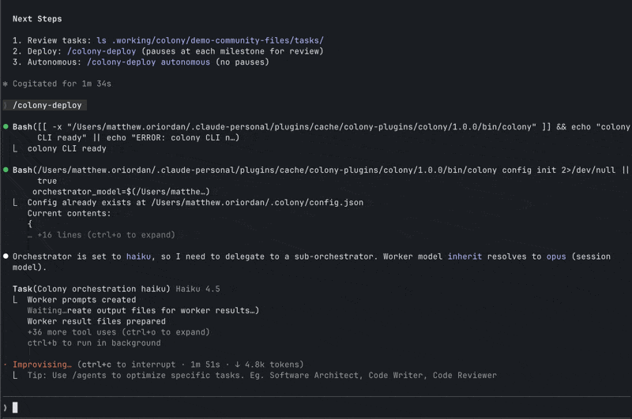
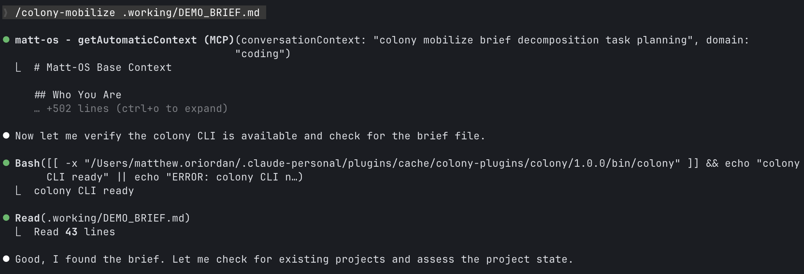
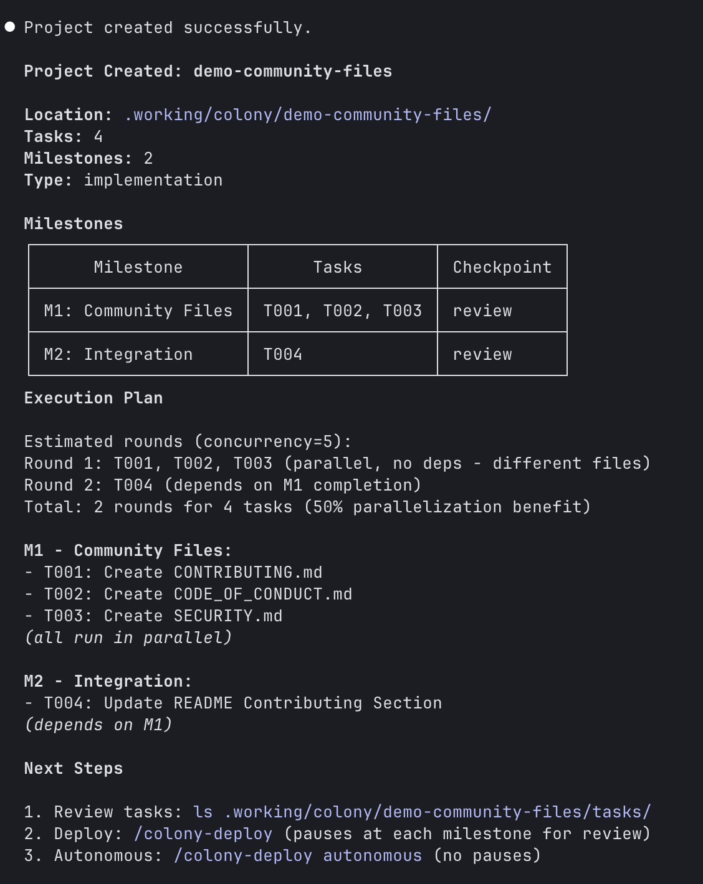
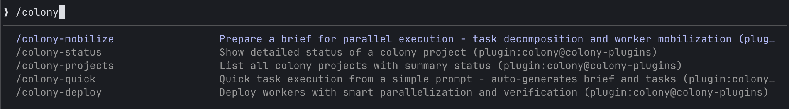

# Colony


**Your AI swarm for serious software engineering.**

Colony turns Claude Code into a parallel task execution engine with independent verification. Give it a complex task, and it spawns a colony of specialized workers—each with fresh context, each verified by an independent inspector.

> **Like Ralph, but built for real work.** Where Ralph iterates sequentially and checks its own homework, Colony intelligently parallelizes work with independent QA. Human-in-the-loop or fully autonomous. Git-aware. Production-ready.

---

## See It In Action



**Smart Mobilization** — Colony analyzes your brief, identifies parallelization opportunities, and prepares tasks for execution:



**Dependency-Aware Deployment** — Tasks deploy in parallel where safe, serialize where necessary:



**Simple Commands** — Everything accessible via `/colony-*` commands:



---

## Why Colony Wins

### v1.2.0: Same Speed, Dramatically Better Quality

Measured on the same task ([Kitty Keyboard Protocol](https://github.com/vadimdemedes/ink/issues/824) implementation), same codebase, same starting point:

| Metric | Ralph | Colony v1.2 | Winner |
|--------|-------|-------------|--------|
| **Runtime** | 12m 39s | ~12 min | Tie |
| **Lint Errors** | 419 | 0 | **Colony** |
| **Lines of Code** | 537 | 165 | **Colony** (3.3x leaner) |
| **PR Ready?** | No (needs cleanup) | Yes | **Colony** |

**The real comparison:** Ralph's 12-minute run produces code needing ~1 hour of cleanup. Colony's 12-minute run produces code ready to merge.

> Reproducible benchmarks: See [`benchmarks/`](./benchmarks/) for the test brief, methodology, and step-by-step reproduction instructions.

### Feature Comparison

| Capability | Traditional AI | Ralph | Colony |
|------------|----------------|-------|--------|
| **Context** | Drifts after 10+ exchanges | Full reset each iteration | Fresh context per task |
| **Verification** | "Done!" (it wasn't) | Checks its own homework | Independent inspector |
| **Code Quality** | Variable | 419 lint errors | **0 lint errors** |
| **Speed** | One thing at a time | Single-threaded | Intelligent parallelization |
| **Oversight** | All or nothing | Autonomous only | Human-in-loop or autonomous |
| **Git workflow** | Manual | Manual | Automatic branch + commits |
| **Recovery** | Start over | Coarse progress file | Task-level resume |
| **Audit trail** | Nothing | Progress notes | Full execution logs |

---

## Colony + Claude Plan Mode

Colony is designed to **complement** Claude's native plan mode, not compete with it.

### The Workflow

```
1. PLAN (Claude Native)
   claude --permission-mode plan
   -> Strategic thinking, requirements, approach
   -> Output: ~/.claude/plans/your-plan.md

2. MOBILIZE (Colony)
   /colony-mobilize
   -> Task decomposition, parallelization, dependencies
   -> Output: .working/colony/{project}/tasks/

3. DEPLOY (Colony)
   /colony-deploy
   -> Parallel execution with independent verification
   -> Output: Working code, logs, report
```

### Why Not Just Use Claude's Execution?

When you exit plan mode, Claude implements sequentially. Colony does it better:

| Aspect | Native Execution | Colony Execution |
|--------|------------------|------------------|
| **Parallelization** | Sequential | Intelligent parallel |
| **Verification** | Self-check | Independent inspector |
| **Context** | Accumulates (drifts) | Fresh per task |
| **Recovery** | Start over | Resume from exact task |
| **Quality** | Variable | 0 lint errors (benchmarked) |

**Use Claude plan mode for thinking. Use Colony for doing.**

---

## Installation

Colony requires **Claude Code** — it uses sub-agents, slash commands, and a CLI tool that aren't available in other agent runtimes.

Colony is part of the [mattheworiordan/powerups](https://github.com/mattheworiordan/powerups) marketplace.

### Step 1: Add the marketplace

```bash
/plugin marketplace add mattheworiordan/powerups
```

### Step 2: Install Colony

```bash
/plugin install colony@powerups-marketplace
```

### Verify Installation

Run `/help` in Claude Code — you should see the `/colony-*` commands listed.

**CLI Tool**: Colony includes a CLI tool (`bin/colony`) for state management. The plugin commands reference it via `${CLAUDE_PLUGIN_ROOT}/bin/colony`, so no PATH setup is needed.

> **Looking for cross-platform skills?** The powerups repo also includes [Counsel](../../skills/counsel/), [Domain Search](../../skills/domain-search/), [Worktree](../../skills/worktree/), and [Worktree Cleanup](../../skills/worktree-cleanup/) — these work with any agent via `npx skills add mattheworiordan/powerups`.

### Working Directory Convention

Colony stores all project state in a `.working/colony/` directory within your project. This includes task files, execution logs, screenshots, and reports.

**Recommendation**: Add `.working/` to your global gitignore:

```bash
echo ".working/" >> ~/.gitignore_global
git config --global core.excludesfile ~/.gitignore_global
```

---

## Key Features

### Intelligent Parallelization
Colony doesn't just run things in parallel—it *thinks* about what can safely parallelize:

- **Dependency analysis** — Understands task dependencies and serializes when needed
- **Resource awareness** — Knows when tasks touch the same files and avoids conflicts
- **Asks when uncertain** — Won't guess on parallelization safety; asks you instead
- **Dynamic adjustment** — Change concurrency mid-run: `"set concurrency to 3"`

### Two Execution Modes

**Human-in-the-Loop (default)**
- Checkpoints between phases for review
- Approve parallelization decisions
- Intervene on failures before retrying

**Fully Autonomous**
- Run overnight without interruption
- Safety limits prevent runaway failures (max retries, failure thresholds)
- Complete report waiting for you in the morning

```bash
/colony-deploy              # Interactive mode
/colony-deploy autonomous   # Autonomous mode
```

### Git-Aware Workflow
Colony understands your git workflow and integrates seamlessly:

- **Branch strategy** — Creates feature branches or works on current branch
- **Smart commits** — After each task, phase, or at project end (you choose)
- **Conventional commits** — Proper commit messages with Co-Authored-By attribution
- **Conflict prevention** — Won't parallelize tasks that touch the same files

### Independent Verification
Every task completion is verified by a separate inspector agent:

- **Fresh context** — Inspector has no knowledge of worker's struggles or workarounds
- **Acceptance criteria** — Checks every criterion, not just "does it compile"
- **Visual verification** — `VISUAL:` criteria trigger screenshot capture and validation
- **No self-deception** — Worker can't mark itself complete; inspector decides

### Full Recovery
Interrupted? Pick up exactly where you left off:

- **Structured state** — All progress saved to `state.json`
- **Task-level granularity** — Resume from the exact task that was interrupted
- **Execution logs** — Every task has detailed logs of what happened
- **Artifact validation** — Screenshots and logs must exist before marking complete

---

## Quick Start

### Recommended: Start with Claude Plan Mode

```bash
# 1. Use Claude's plan mode to define requirements
claude --permission-mode plan
> I need to add OAuth2 authentication. Interview me about requirements.

# 2. Claude creates a plan in ~/.claude/plans/
# 3. Mobilize Colony with that plan
/colony-mobilize

# 4. Colony auto-detects the recent plan, or specify:
/colony-mobilize ~/.claude/plans/gleaming-sniffing-bird.md

# 5. Deploy
/colony-deploy
```

### Option 1: Create a Brief File

```bash
# 1. Create a brief describing what you want to accomplish
cat > .working/MY_FEATURE_BRIEF.md << 'EOF'
# Add User Authentication

## Goal
Add login/logout functionality with session management.

## Requirements
- [ ] Login form with email/password
- [ ] Session storage in localStorage
- [ ] Protected routes redirect to login
- [ ] Logout clears session
EOF

# 2. Plan the tasks
/colony-mobilize .working/MY_FEATURE_BRIEF.md

# 3. Review the decomposition, then run
/colony-deploy
```

### Option 2: Point to Any File

```bash
/colony-mobilize docs/FEATURE_SPEC.md
/colony-mobilize ~/Desktop/my-project-plan.md
```

### Option 3: Describe Inline

```bash
/colony-mobilize
# Colony will ask for your requirements if no brief is found
```

### Option 4: Quick Tasks

```bash
/colony-quick "Add a loading spinner to the submit button"
```

---

## Commands

| Command | Description |
|---------|-------------|
| `/colony-mobilize [brief]` | Prepare tasks from a brief or Claude plan |
| `/colony-deploy [project]` | Deploy workers with verification |
| `/colony-deploy autonomous` | Deploy without human checkpoints |
| `/colony-status [project]` | Show detailed project status |
| `/colony-projects` | List all colony projects |
| `/colony-quick "prompt"` | Quick execution for simple tasks |

---

## How It Works

### 1. Mobilization Phase (`/colony-mobilize`)

- Finds a brief file or Claude plan (auto-detects recent plans)
- Analyzes the codebase for parallelization opportunities
- Decomposes work into executable tasks
- Identifies shared patterns to prevent duplication (DRY)
- Detects project standards (linter, CLAUDE.md, etc.)
- Sets up Git strategy (branch, commit frequency)

### 2. Deployment Phase (`/colony-deploy`)

- Spawns isolated **worker** agents for each task
- Runs tasks in parallel where safe
- Independent **inspector** agents verify each completion
- Automatic retry on failure (up to 3 attempts)
- Git commits at phase boundaries
- Comprehensive report generation

### 3. Key Concepts

**Context Isolation**: Each worker runs in a fresh context with only the information it needs. No context drift from accumulated conversation history.

**Independent Verification**: A separate inspector agent checks every "DONE" claim. Catches workarounds, missing criteria, and design intent violations.

**Smart Parallelization**: Analyzes dependencies and resource constraints. Asks when uncertain. Serializes browser tests, database migrations, etc.

**Artifact Validation**: Log files and screenshots must exist before marking complete. Never trusts agent claims without filesystem proof.

**Recovery**: All state persisted to JSON. Pick up exactly where you left off if interrupted.

**Autonomous Mode**: Run overnight without checkpoints. Safety limits prevent runaway failures.

---

## Brief Discovery

When you run `/colony-mobilize` without specifying a file, Colony searches for potential briefs in:

1. **`~/.claude/plans/*.md`** - Recent Claude plans (last 48 hours), ranked by relevance
2. **`.working/*.md`** - The conventional location for working documents
3. **`docs/*.md`** - Documentation folder
4. **Root `.md` files** - Excluding README, CHANGELOG, LICENSE

If multiple candidates are found, Colony shows them ranked by relevance and asks which to use.

---

## Project Structure

When you run `/colony-mobilize`, it creates:

```
.working/colony/{project-name}/
├── context.md              # Project rules, tech stack, parallelization
├── state.json              # Task status, Git config, execution log
├── tasks/
│   ├── T001.md            # Individual task files
│   ├── T002.md
│   └── ...
├── logs/
│   ├── T001_LOG.md        # Execution + verification logs
│   └── ...
├── screenshots/            # Visual verification evidence
├── resources/
│   └── original-brief.md  # Copy of source brief
└── REPORT.md              # Final execution report
```

---

## Colony vs Ralph

[Ralph](https://www.cursor.com/blog/ralf) popularized autonomous AI coding with a clever while-loop approach. Colony takes it further.

### The Key Insight

**Ralph's weakness**: It checks its own homework. The same model that claims "done" also decides if it's really done.

**Colony's answer**: Independent verification. A separate inspector agent—with fresh context and no ego investment—verifies every completion.

### Head-to-Head (v1.2.0 Benchmarks)

Both approaches ran the same task: implement [Kitty Keyboard Protocol](https://github.com/vadimdemedes/ink/issues/824) for the [Ink](https://github.com/vadimdemedes/ink) React CLI framework.

| Metric | Colony | Ralph |
|--------|--------|-------|
| **Runtime** | ~12 min | 12m 39s |
| **Lint Errors** | **0** | 419 |
| **Lines of Code** | **165** | 537 |
| **Time to Merge** | **12 min** | ~72 min (with cleanup) |

> See [`benchmarks/v1.2-results.md`](./benchmarks/v1.2-results.md) for detailed methodology and quality scoring.

### When to Use Each

**Choose Colony when:**
- You need production-ready code (0 lint errors)
- Work can be parallelized (most real projects)
- You need proof that tasks are actually complete
- You're building code that goes straight to PR

**Choose Ralph when:**
- Tasks are strictly sequential
- You want zero setup (just a prompt pattern)
- You're exploring/prototyping (quality doesn't matter yet)

---

## Configuration

Colony can be configured via `~/.colony/config.json`. Created automatically on first run with sensible defaults.

```json
{
  "working_dir": ".working",
  "models": {
    "orchestrator": "default",
    "worker": "default",
    "inspector": "default"
  }
}
```

### Model Roles

| Role | What it does | Default | Recommendation |
|------|--------------|---------|----------------|
| `orchestrator` | Coordinates tasks, manages state, spawns workers/inspectors | `sonnet` | `sonnet` - must reliably follow complex prompts |
| `worker` | Implements code, runs tests, creates files | `inherit` | `inherit` - needs full reasoning power |
| `inspector` | Verifies task completion, checks criteria | `haiku` | `haiku` - verification is simpler |

### Model Options

- **`inherit`** - Uses your Claude Code session's model (Opus, Sonnet, etc.)
- **`haiku`** - Fast and cheap, good for mechanical tasks
- **`sonnet`** - Balanced capability and speed
- **`opus`** - Maximum capability, slower

### Concurrency

```
# During execution
"set concurrency to 3"   # Run 3 workers in parallel
"set concurrency to 10"  # Run 10 workers in parallel
"serialize"              # Set concurrency to 1
```

Default is 5. Adjust based on your machine resources and task complexity.

### Git Strategy

Configured during `/colony-mobilize`:
- **Branch**: Feature branch or current branch
- **Commits**: After each task, phase, or at end
- **Style**: Conventional commits with Co-Authored-By

### Autonomous Mode

```
/colony-deploy autonomous
```

Safety limits: Max 3 retries per task. Stops if >50% of tasks fail. Max iterations = total_tasks x 3.

---

## Task File Format

Each task file (`.working/colony/{project}/tasks/T{NNN}.md`) contains:

```markdown
# Task T001: Setup Authentication

## Status
pending

## Context & Why
{Why this task exists, how it fits the broader goal}

## Design Intent
{Philosophy, user preferences, what to avoid}

## Description
{What needs to be done}

## Files
- src/auth/login.js
- src/auth/session.js

## Acceptance Criteria
- [ ] Login form validates email format
- [ ] VISUAL: Form shows error state on invalid input
- [ ] Session persists across page reload

## Completion Promise
When done, output: TASK_COMPLETE: T001

## Verification Command
npm test -- --testPathPattern=auth

## Dependencies
None

## Parallel Group
setup
```

---

## Troubleshooting

### "No projects found"
Run `/colony-mobilize` first to create a project from a brief.

### Task stuck in "running"
Tasks running >30 minutes reset to "pending" on next `/colony-deploy`.

### Verification keeps failing
Read the inspector's feedback in `.working/colony/{project}/logs/{task}_LOG.md`. It includes specific suggestions.

### Browser verification not working
Ensure you have browser automation tools available (Playwright, Puppeteer). Colony will use whatever browser automation is available in your environment.

---

## Changelog

See [CHANGELOG.md](./CHANGELOG.md) for version history.

---

## Contributing

Contributions welcome! Please:
1. Fork the [powerups repository](https://github.com/mattheworiordan/powerups)
2. Create a feature branch
3. Add tests for new functionality
4. Submit a pull request

## License

MIT — See [LICENSE](../../LICENSE) for details.

---

**Built by [Matthew O'Riordan](https://github.com/mattheworiordan)**, CEO at [Ably](https://ably.com)

[Ably](https://ably.com) powers realtime experiences with trillions of messages for billions of devices each month.

Building AI agents? Check out [Ably AI Transport](https://ably.com/solutions/ai-agents) — drop-in infrastructure for resilient, steerable AI UX.
